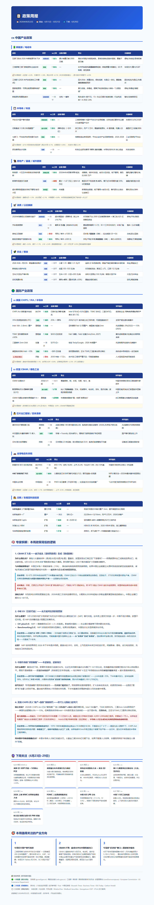

# 政策与产业追踪周报

每周自动聚合的中国 & 国际产业政策、宏观信号、AI/半导体/新能源行业动态。



## 📋 报告结构（v2）

| 板块 | 内容 |
|------|------|
| 🇨🇳 中国产业政策 | 新能源/电动车、半导体/科技、房地产/基建、消费/以旧换新、农业 |
| 🌍 国际产业政策 | 美国 CHIPS/IRA、欧盟 CBAM/绿色工业、芯片管制、EV 关税、日韩/东南亚 |
| 🧠 专家拆解 | 每周 2-4 条最重要政策的深度分析（含历史参照 + 反对观点） |
| 🔮 下周关注 | 未来一周关键数据发布、央行会议、财报、论坛 |
| 🎯 产业方向 | 2-3 个政策驱动的具体机会或风险 |

## 🎨 特性

- 纯 HTML 输出，表格列宽精确，浏览器 `Ctrl+P` 即可导出 PDF
- 每行政策标注：类型（新政/续期）、vs 上周变动（↑↓→）、金额规模、市场映射
- 来源按可信度分级（🟢官方一手 / 🔵权威媒体 / ⚪券商智库）

## 🚀 使用

```bash
python gen_report_v2.py    # 生成周报
start 周报-政策追踪-YYYY-MM-DD.html  # 打开
```

## 📁 文件

| 文件 | 说明 |
|------|------|
| `gen_report_v2.py` | 周报模板脚本 |
| `周报-政策追踪-YYYY-MM-DD.html` | 每周报告 |
| `日报-YYYY-MM-DD.md` | 日报（旧格式） |

## ⚠️ 免责

市场数据仅作信息参考，不构成投资建议。
