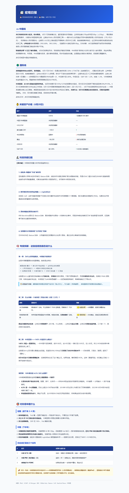
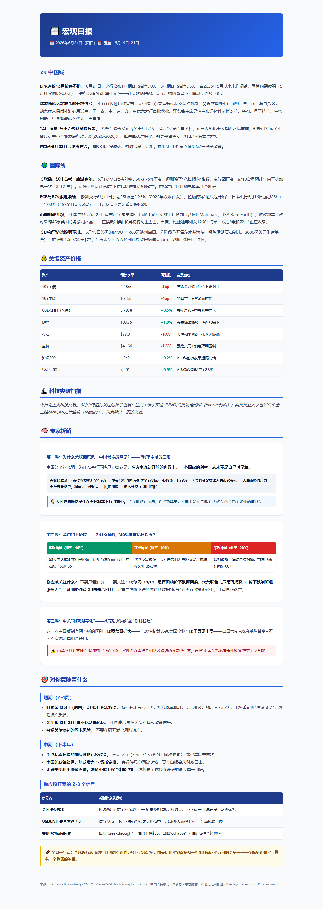
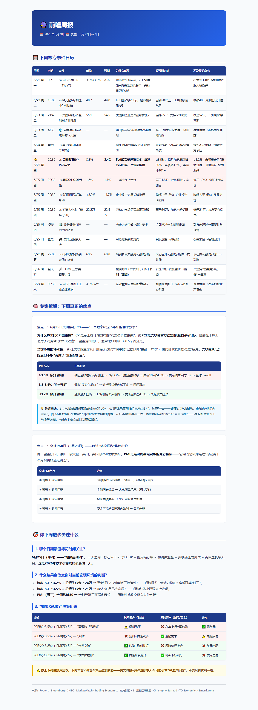

# Policy Tracker — AI 驱动的政策与产业周报

每周自动聚合中国 & 国际产业政策、宏观信号、AI/半导体/新能源行业动态。

## 📸 效果预览

### 周报（政策追踪）


### 日报（宏观）
| 6月20日 | 6月21日 |
|----------|----------|
|  |  |

### 下周前瞻


## 🚀 快速开始

这个项目设计为 **Claude Code + 人工配合** 使用。生成一期周报分三步：

### 1. 启动研究 Agent
```
搜索上周全球产业政策，按行业分中+国际汇总，保存到 D:\news\周报-政策追踪-YYYY-MM-DD.html（用本周一的日期）。
```
Claude 会自动：
- 并行搜索中国/美国/欧盟/日韩等区域政策
- 按行业分类整理
- 生成带完整 CSS 样式的 HTML 报告

### 2. 审核 & 迭代
- 浏览器打开 HTML，检查内容完整性和排版
- 如果有缺漏，追问 Claude 补充
- 如果排版不满意，Claude 可以当场改 CSS

### 3. 发布到 GitHub
```bash
git add -A && git commit -m "周报 YYYY-MM-DD" && git push
```

## 📋 报告体系

| 报告 | 频率 | 内容 |
|------|------|------|
| **周报-政策追踪** | 每周一 | 中+国际产业政策、深度拆解、下周关注 |
| **日报-宏观** | 不定期 | 当日重大宏观事件、资产价格、科技突破 |
| **周报-前瞻** | 每周日 | 下周事件日历、核心数据预期、决策矩阵 |

## 🎨 报告特性

- 纯 HTML，表格列宽精确，`Ctrl+P` 导出 PDF
- 每行政策：新政/续期标签、vs 上周变动（↑↓→）、金额规模、市场映射
- 深度拆解：历史参照 + 反对观点 + 量化预测
- 来源按可信度分级（🟢官方 🟡权威 ⚪智库）

## 🤖 Claude 编写这份周报时使用的默认流程

每次生成周报前，默认执行以下搜索（可并行的已归为一组）：

**第一轮（并行）**：
1. 中国产业政策最新（新能源+电动车+半导体+房地产+消费+农业，当周日期）
2. US CHIPS Act / IRA / semiconductor export controls latest
3. EU CBAM / green industrial policy / critical raw materials latest

**第二轮（按需补充）**：
4. 中国专项债发行进度 + 以旧换新补贴数据
5. EU-China EV tariff / anti-subsidy latest
6. 日韩东南亚半导体投资（TSMC 熊本、三星、SK 海力士）
7. 下周全球经济数据发布日历

**写作规范**：
- 政策名+类型（新政/续期/加码/收紧）+ 金额 + 有效期 + 要点 + 市场映射
- 金额列不能写"—"，必须填具体数字或解释为什么无法获取
- 每条深度拆解含：为什么现在出 + 历史参照 + 反对观点 + 后续演化
- 来源分级：官方一手公告 > 权威媒体报道 > 券商/智库分析

## 📁 文件结构

```
D:\news\
├── gen_report_v2.py          # 周报 HTML 模板（Python 脚本）
├── gen_daily_reports.py      # 日报+前瞻 HTML 模板
├── 周报-政策追踪-YYYY-MM-DD.html
├── 日报-YYYY-MM-DD.html
├── 周报-前瞻-YYYY-MM-DD.html
├── screenshot.png            # 效果图
└── README.md
```

## ⚠️ 免责

市场数据仅作信息参考，不构成投资建议。
